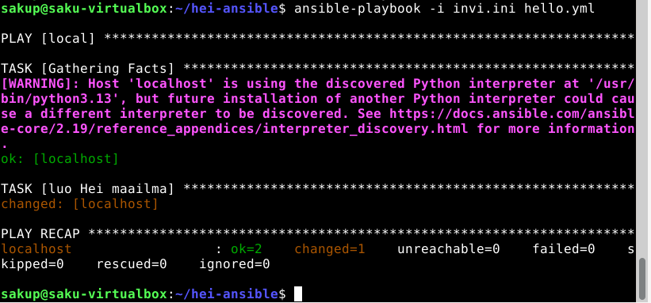

x) SSH public key - Login Without password
- Ensiksi generoidaan avainpari (Oma huomio vain julkinen avain voidaan jakaa muille)
- Komenolla ssh-copy-id kopiodaan se hostiin sen jälkeen kun olet kirjoittanut salasanan viimeisen kerran komento lisää julkisen aveimen semmoiseksi, että sillä katsotaan olevan oikeudet kirjautumiseen 
(oma huomio, oma kone allekirjoitta salaisella avaimella ja jos palvelin tarkastaa ja se vastaa julkista avainta pääsee sisään jos taas avaimet eivät vastaa toisiaan ei pääse sisään)

x) Hello Ansible
- Aluksi asennetaa Ansible komennoilla sudo apt-get update, sudo apt-get install ansible micro bash-completion tree (oma huomio, jos ei aja komentoa sudo apt-get update kone käyttää vanhaa listaa ja voi olla että
asentuu vanha versio)
- Seuraavaksi ohjeessa testataan Ansiblea ja kirjataan kaikki hostit mitä ohjataan .ini (oma huomio voi käyttää myös .txt, .ini kertoo ihmiselle että kyseessä konfiguraatio mutta sama toimii myös .txt)
- Seuraavaksi ohjeessa tehdää file ja runnataa playbook ja voidaan nähdä että se tekee muutokseen slaveen. (Kysymys miten ansible varmistaa että palybook voidaan ajaa useita kertoja ilman turhia muutoksia)

a) 
- ensiksi asennetaan SSH (sudo apt-get update, sudo apt-get install openssh-server)
- sitten käynnistetään (SSH sudo systemctl start ssh, sudo systemctl enable ssh)
- viimeiseksi kirjaudutaan (ssh localhost)

b)
- aluksi tehdää avain (ssh-keygen)
- sitten se kopiodaan ssh-copy-ide käyttäjänimi@localhost
-ja viimeiseksi kun testaa esim ssh localhost toimii jos ei kysy salasanaa ja menee suoraan sisään

c)
- Inventory tiedosto määrillee localhostin ja ssh-yhteyden (eli mitä koneita hallitaan ja miten niihin yhdistetään esim tässä tapauksessa "ansible_connection=ssh)
- playbook luo tiedsoton /tmp/hellot.txt
- playbookin ajoin komennolla "ansible-playbook -i invi.ini hello.yml
- sain tulokseksi changed=1 eli tiedosto luotiin

lähteet 
- https://docs.ansible.com/projects/ansible/latest/user_guide/index.html
- https://terokarvinen.com/ssh-public-key-login-without-password/
- https://terokarvinen.com/hello-ansible/
- Tehtävässä c) hyödynnettiin ChatGPT 3.5 -kielimallia. Syötteenä käytettiin: "kun käytän ansiblea mitä ini ja yml tiedostoilla tehdään ja mitä niihin tulisi laittaa" ja "mitä kaikkea tarvitaan playbookin ajamiseen"
